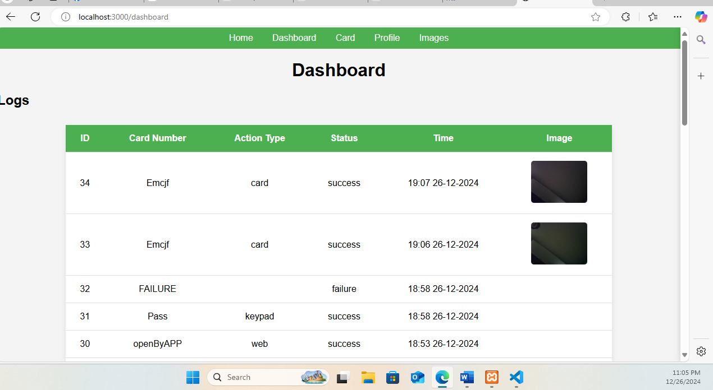
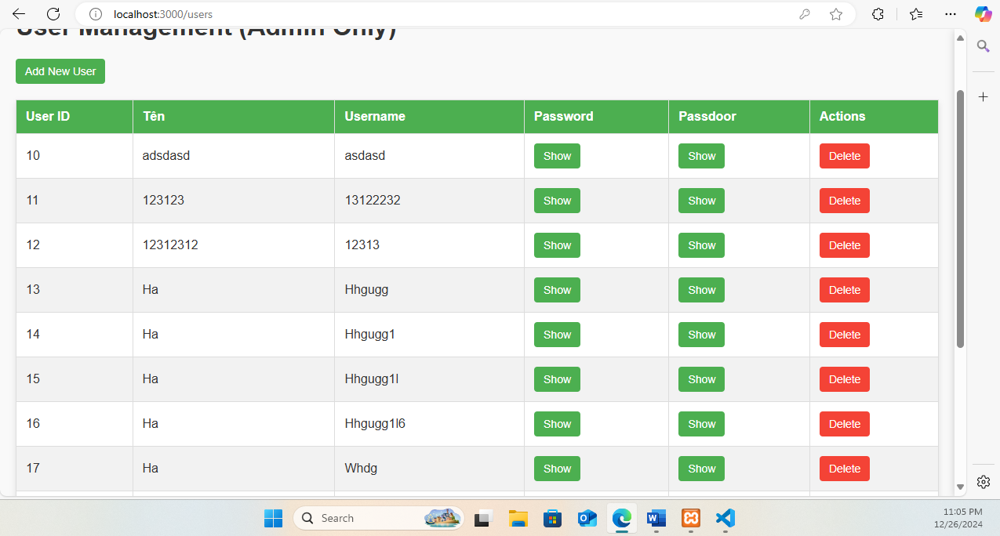
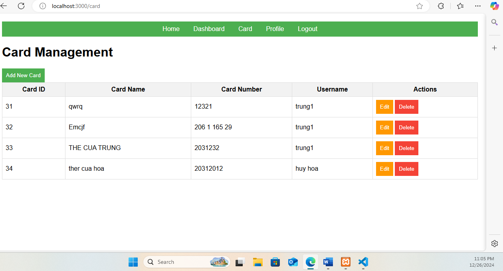
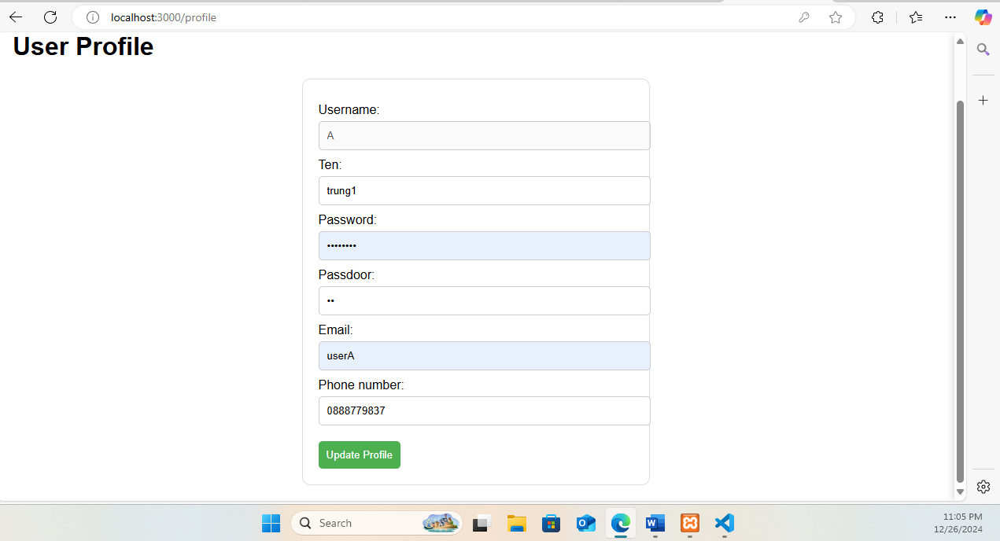
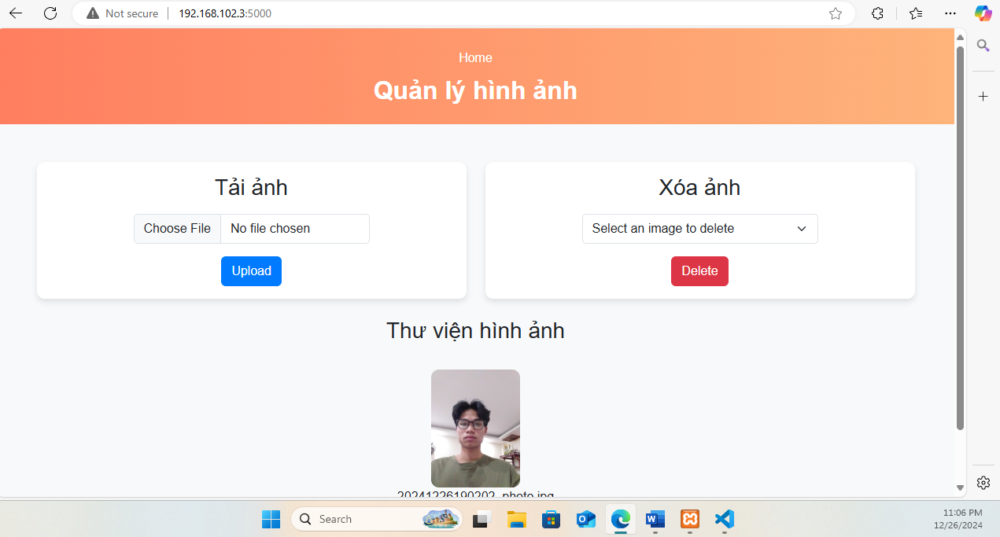

# Open with face
## Mô tả
- Ứng dụng mở cửa bằng khuôn mặt, thẻ từ, keypad
- Ứng dụng có 2 phần chính: webjs và python
- webjs: phần mở khoá bằng thẻ từ, keypad: hiện thị giao diện quản lý người dùng, thêm, sửa, xóa người dùng, phân quyền, quản lý thẻ của người dùng
- python: phần mở khoá bằng khuôn mặt, nhận dữ liệu từ webjs, hiện thị giao diện quản lý ảnh

## Cấu trúc
- Folder test/test.ino: chứa code test cho arduino quét thẻ từ, thêm thẻ từ, mở khoá
- Folder WIFICAM/WIFICAM.ino: chứa code cho arduino quét khuôn mặt, thêm ảnh, mở khoá
- Folder webjs: chứa code cho phần webjs
- Folder Python: chứa code cho phần python

## Cách cài đặt

1. `git clone https://github.com/phamvantu1/openWithFace.git` `git checkout trunghoa`
2. Import file smartdoor.sql vào db local
3. Sửa mấy cái credentials db (mấy chỗ liền webjs có 1 chỗ, python có 2 )
4. chạy câu lệnh `cd webjs`
5. chạy tiếp `npm i`
6. chạy `npm start` thế là con js đã chạy rồi
7. chạy con python (mở terminal mới) `cd Python`
8. chạy `pip install -r requirements.txt
`
9.  chạy `python controller.py`
10. import iot_postman_collection.json vào postman để test nhớ truyền token vào

## Một số hình ảnh

Giao diện chính 

Giao diện quản lý người dùng

Giao diện quản lý thẻ

Giao diện cập nhật thông tin người dùng

Giao diện quản lý ảnh
