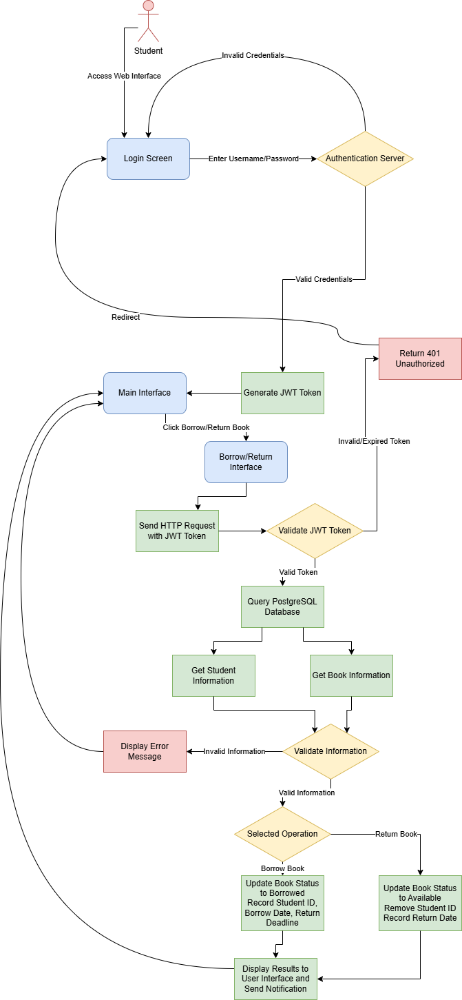
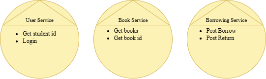
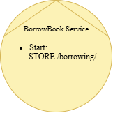
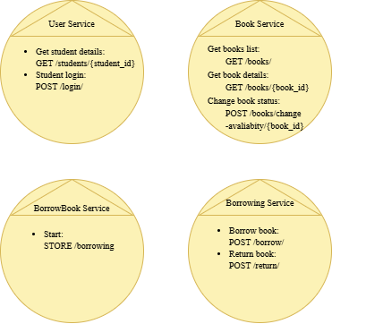
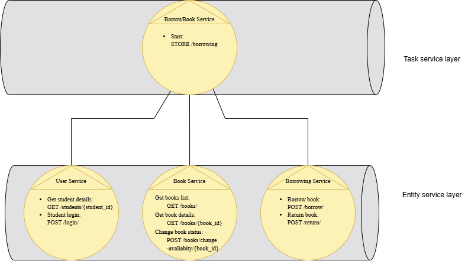
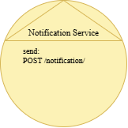
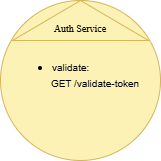
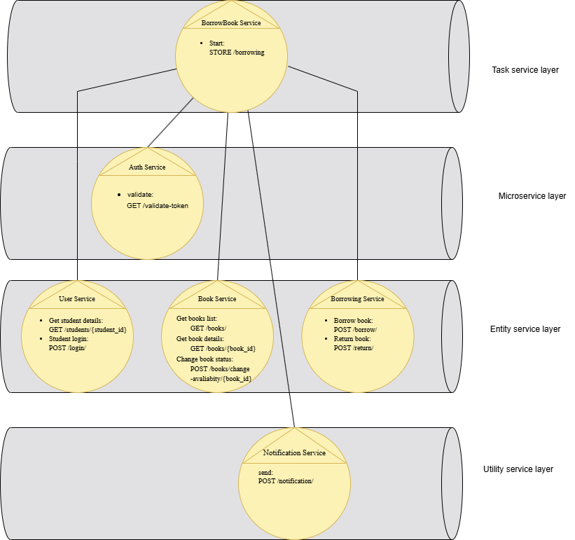

# ĐỀ TÀI: HỆ THỐNG MƯỢN SÁCH
## I. Giới thiệu thành viên:
- Ngô Thế Quang Tiến - B21DCCN705
- Nguyễn Thanh Hải - B21DCCN321
- Ngô Quốc Việt - B21DCCN789
## II. Giới thiệu đề tài:
> Hệ thống mượn sách cho phép sinh viên đăng nhập để tra cứu danh sách sách, mượn sách, và trả sách thông qua giao diện web. Sinh viên phải đăng nhập để xác thực danh tính trước khi thực hiện các thao tác mượn hoặc trả sách đồng thời người dùng cũng không được sử dụng chức năng mượn trả sách nếu có sách quá hạn hoặc mượn >5 sách. Hệ thống xác minh thông tin sinh viên và trạng thái sách, truy xuất danh sách sách hoặc thực hiện thao tác mượn/trả, cập nhật trạng thái sách, và hiển thị kết quả cho người dùng.

- **Usecase**:
  - Mượn và trả sách cho sinh viên
## III. Công nghệ sử dụng:
- **Back-end**: Python (FastAPI).
- **Front-end**: React, Tailwind CSS.
- **Database**: PostgreSQL.
- **API Communication**: RESTful APIs with `fetch` và `async`/`await` trong JavaScript.
- **Authentication**: JWT (JSON Web Tokens).
- **Monitoring**: Prometheus, Grafana (optional for observability).

## IV. Phân tích:
### 1. Quy trình mượn/trả sách gồm các hoạt động chi tiết sau:
- **Bước 1**: Sinh viên đăng nhập vào hệ thống bằng tài khoản (username/password).
- **Bước 2**: Sinh viên bấm nút “Mượn sách”/“Trả sách”.
- **Bước 3**: Hệ thống xác minh token JWT để đảm bảo sinh viên đã đăng nhập.
- **Bước 4**: Hệ thống truy xuất thông tin sinh viên và sách từ cơ sở dữ liệu.
- **Bước 5**:
  - Nếu thông tin hợp lệ (sinh viên hợp lệ, sách tồn tại, trạng thái phù hợp), chuyển sang bước 6.
  - Nếu thông tin không hợp lệ (sinh viên không tồn tại, sách không sẵn, hoặc token không hợp lệ), hiển thị lỗi và yêu cầu đăng nhập lại.
- **Bước 6**: Hệ thống thực hiện thao tác mượn/trả cập nhật trạng thái sách, và hiển thị kết quả.

### 2. Phân tích quy trình nghiệp vụ:
- Quy trình mượn/trả sách được chia thành các hành động sau:
  - Bắt đầu quy trình mượn/trả sách
  - Sinh viên đăng nhập và nhận token JWT.
  - Sinh viên bấm nút mượn/trả sách.
  - Xác minh token JWT để đảm bảo phiên đăng nhập hợp lệ.
  - Nhận thông tin chi tiết về sinh viên.
  - Nhận thông tin chi tiết về sách.
  - Xác minh thông tin (sinh viên hợp lệ, sách sẵn để mượn, hoặc sách đã mượn để trả).
  - Nếu thông tin không hợp lệ, kết thúc quá trình và hiển thị lỗi.
  - Nếu thông tin hợp lệ, thực hiện thao tác và cập nhật trạng thái sách.
  - Gửi thông báo kết quả (mượn/trả thành công hoặc thất bại) cho sinh viên.

### 3. Lọc ra các hành động không phù hợp:
- Một số hoạt động không phù hợp tự động hóa hoặc đóng gói dịch vụ sẽ bị gạch bỏ:
  - Bắt đầu quy trình mượn/trả sách
  - Sinh viên đăng nhập và nhận token JWT.
  - Xác minh token JWT.
  - Nhận thông tin chi tiết về sinh viên.
  - Nhận thông tin chi tiết về sách.
  - Xác minh thông tin.
  - Nếu thông tin không hợp lệ, kết thúc quá trình.
  - Nếu thông tin hợp lệ, thực hiện thao tác và cập nhật trạng thái.
  - Gửi thông báo kết quả cho sinh viên.
  - ~~Sinh viên chọn sách từ danh sách hiển thị.~~
  - ~~Sinh viên xác nhận mượn/trả qua giao diện.~~
### 4. Xác định các ứng viên Entity Service:
- Bằng cách phân tích các hành động còn lại, phân loại những hành động được coi là bất khả tri. Những hành động không theo bất khả tri được in đậm:
  - **Bắt đầu quy trình mượn/trả sách**
  - **Sinh viên đăng nhập.**
  - **Sinh viên bấm nút mượn/trả sách.**
  - **Xác minh token JWT.**
  - Nhận thông tin chi tiết về sinh viên.
  - Nhận thông tin chi tiết về sách.
  - **Xác minh thông tin.**
  - **Nếu thông tin không hợp lệ, kết thúc quá trình.**
  - **Nếu thông tin hợp lệ, thực hiện thao tác và cập nhật trạng thái.**
  - **Gửi thông báo kết quả cho sinh viên.**

- Các hành động bất khả tri được phân loại thành Entity Service sơ bộ và được nhóm lại thành:
  - **User-Service**: Quản lý đăng nhập và thông tin sinh viên (POST /login, GET /students/{student_id}).
  - **Book-Service**: Cung cấp thông tin sách và trạng thái sẵn có (GET /books, GET /books/{book_id}).
  - **Borrowing-Service**: Quản lý thao tác mượn/trả sách (POST /borrow, POST /return).

### 5. Xác định logic cụ thể cho quy trình:
- Các hành động không tuân theo bất khả tri vì chúng được quy định cụ thể cho quy trình mượn/trả sách:
  - Bắt đầu quy trình mượn/trả sách.
  - **Sinh viên đăng nhập.**
  - **Sinh viên bấm nút mượn/trả sách.**
  - **Xác minh token JWT.**
  - **Xác minh thông tin.**
  - **Nếu thông tin không hợp lệ, kết thúc quá trình.**
  - **Nếu thông tin hợp lệ, thực hiện thao tác và cập nhật trạng thái.**
  - **Gửi thông báo kết quả cho sinh viên.**
- Hành động bắt đầu quy trình mượn/trả sách là cơ sở để tạo nên một task service.
- Hành động đăng nhập và thao tác mượn/trả tạo cơ sở cho ứng viên năng lực dịch vụ, được gọi là **BorrowBook-Service**.
- Các hành động in đậm còn lại là logic nội bộ trong **BorrowBook-Service**.
- Hành động xác minh token JWT được tách ra thành **Auth-Service** trong tầng microservice để tập trung hóa logic xác thực.

### 6. Xác định các nguồn lực:
- **Danh sách các ngữ cảnh chức năng để xác định tài nguyên**:
  - Non-agnostic: `/Borrowing Process/` (quy trình mượn/trả sách, đặc thù cho tác vụ này).
  - Agnostic: `/Users/`, `/Books/`, `/Borrowings/`, `/Notifications/`, `/Auth/` (các tài nguyên tái sử dụng được).
- **Ánh xạ giữa thực thể/dịch vụ và tài nguyên**:

| Entity/Service       | Resource            |
|:--------------------:|:-------------------:|
| User                 | /students/            |
| Book                 | /books/            |
| Borrowing            | /borrowings/       |

### 7. Liên kết năng lực dịch vụ với tài nguyên phương thức:
- **Liên kết các dịch vụ với tài nguyên và phương thức HTTP**:
  - **BorrowBook-Service (Task)**: 
    - Method: `STORE /borrowing` (khởi động quy trình mượn/trả sách).
  - **Auth-Service (Microservice)**:
    - Method: `GET /validate-token` (xác thực token JWT).
  - **User-Service (Entity)**: 
    - Resource: `/students/`
    - Methods: `POST /login` (đăng nhập), `GET /students/{student_id}` (lấy thông tin sinh viên).
  - **Book-Service (Entity)**: 
    - Resource: `/books/`
    - Methods: `GET /books` (liệt kê sách), `GET /books/{book_id}` (lấy thông tin sách), `POST /books/change-avaliabity/{book_id}/` (Đổi trạng thái sách).
  - **Borrowing-Service (Entity)**: 
    - Resource: `/borrowings/`
    - Methods: `POST /borrow` (thực hiện mượn sách), `POST /return` (thực hiện trả sách),`GET /borrowing-table/{student_id}` (lấy danh sách sách đã mượn), `GET /borrowing-history/{student_id}` (lấy lịch sử sách đã trả).
  - **Notification-Service (Utility)**: 
    - Method: `POST /notification` (gửi thông báo).

### 8. Áp dụng hướng dịch vụ:
- Quy trình mượn/trả sách sử dụng các nguyên tắc định hướng dịch vụ (SOA) để đảm bảo tính độc lập, tái sử dụng, và khả năng mở rộng của các dịch vụ.
- Mỗi dịch vụ (**User**, **Book**, **Borrowing**, **BorrowBook**) được thiết kế để xử lý một phần cụ thể của quy trình, với giao tiếp qua RESTful APIs.

### 9. Xác định ứng viên thành phần dịch vụ:
- **BorrowBook-Service** gọi **User-Service**, **Book-Service**, và **Borrowing-Service**.

### 10. Phân tích các yêu cầu xử lý:
- Hành động xác minh thông tin và token JWT được thực hiện trong **BorrowBook-Service** thông qua gọi **User-Service** và **Book-Service**.
- **Notification-Service** xử lý việc gửi thông báo kết quả.

### 11. Xác định ứng viên dịch vụ tiện ích:
- **Notification-Service**: Hành động Send với phương thức `POST /notification`.

### 12. Xác định ứng viên vi dịch vụ:
- **Auth-Service**: Hành động validate với phương thức `GET /validate-token`.

## 13. Kết quả sau khi phân tích:

