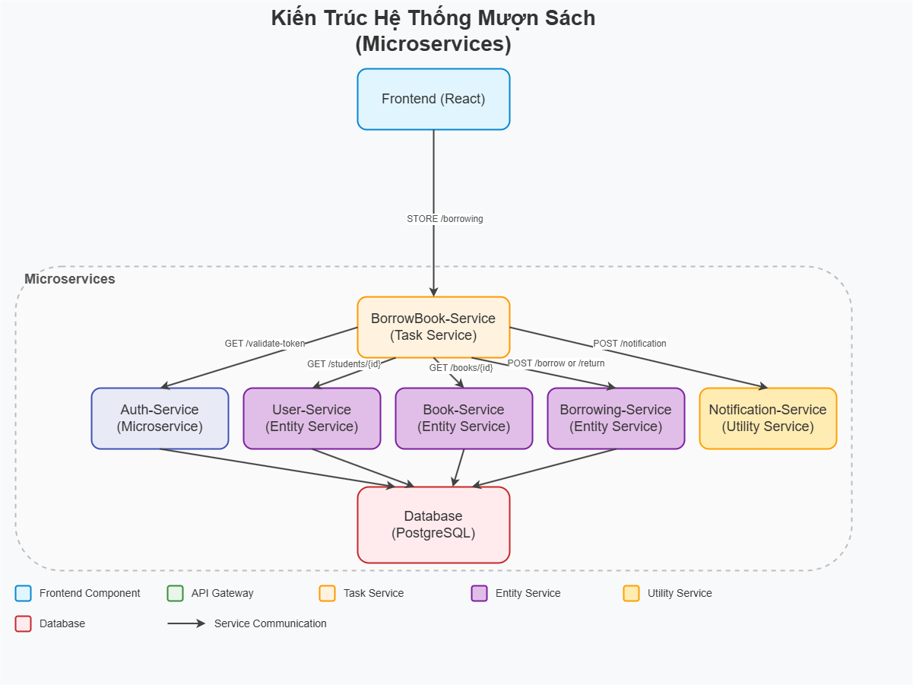
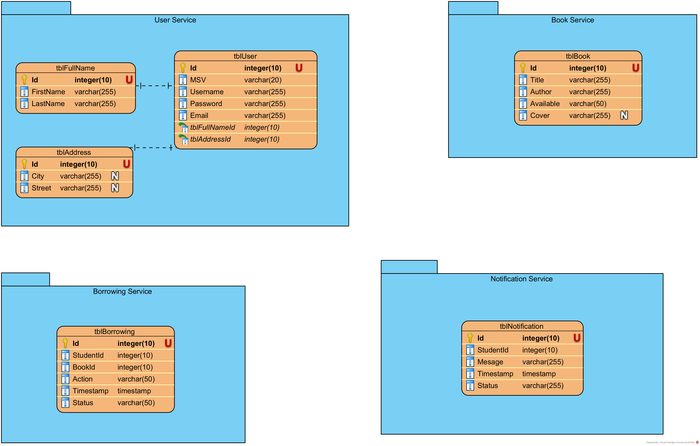

# Kiến Trúc Hệ Thống

## Tổng Quan
Hệ thống Mượn Sách là một hệ thống microservices được thiết kế để hỗ trợ sinh viên đăng nhập, tra cứu danh sách sách, mượn sách, và trả sách thông qua giao diện web. Mục tiêu chính là đảm bảo tính độc lập, tái sử dụng, và khả năng mở rộng của các dịch vụ, đồng thời cung cấp trải nghiệm người dùng mượt mà và an toàn. Hệ thống sử dụng các nguyên tắc định hướng dịch vụ (SOA) và được triển khai với Docker để dễ dàng quản lý và mở rộng.

Các thành phần chính bao gồm các microservices xử lý từng chức năng cụ thể, giao tiếp qua API Gateway (Nginx), và lưu trữ dữ liệu trong cơ sở dữ liệu PostgreSQL. Hệ thống cũng tích hợp xác thực JWT để bảo mật và các công cụ giám sát như Prometheus/Grafana (tùy chọn) để theo dõi hiệu suất.

## Thành Phần Hệ Thống
- **BorrowBook-Service (Task Service)**:  
  Dịch vụ này khởi động quy trình mượn hoặc trả sách thông qua endpoint `POST /borrowing`. Nó gọi các dịch vụ khác (Auth-Service, User-Service, Book-Service, Borrowing-Service) để xác thực và xử lý yêu cầu, sau đó gửi thông báo kết quả qua Notification-Service.

- **Auth-Service (Microservice)**:  
  Dịch vụ này tập trung hóa logic xác thực token JWT thông qua endpoint `GET /validate-token`. Các dịch vụ khác gọi Auth-Service để kiểm tra tính hợp lệ của token trước khi thực hiện các thao tác.

- **User-Service (Entity Service)**:  
  Quản lý thông tin sinh viên và xác thực người dùng. Cung cấp hai endpoint: `POST /login` để sinh viên đăng nhập và nhận JWT token, và `GET /students/{student_id}` để lấy thông tin chi tiết về sinh viên.

- **Book-Service (Entity Service)**:  
  Quản lý thông tin sách, cung cấp danh sách sách qua `GET /books` và thông tin chi tiết của một cuốn sách qua `GET /books/{book_id}`.

- **Borrowing-Service (Entity Service)**:  
  Xử lý các giao dịch mượn/trả sách với các endpoint `POST /borrow` (mượn sách) và `POST /return` (trả sách). Dịch vụ này cập nhật trạng thái sách và lưu lịch sử giao dịch vào cơ sở dữ liệu.

- **Notification-Service (Utility Service)**:  
  Gửi thông báo đến sinh viên thông qua endpoint `POST /notification`, ví dụ: thông báo mượn/trả sách thành công hoặc thất bại.

- **API Gateway (Nginx)**:  
  Đóng vai trò là điểm truy cập duy nhất cho frontend, định tuyến các yêu cầu đến các dịch vụ phù hợp dựa trên đường dẫn URL (ví dụ: `/borrowing` → BorrowBook-Service, `/validate-token` → Auth-Service). API Gateway cũng hỗ trợ các tính năng như ghi log và giám sát (Prometheus/Grafana).

- **Frontend (React)**:  
  Giao diện web được xây dựng bằng React và Tailwind CSS, tương tác với API Gateway để hiển thị danh sách sách, thực hiện mượn/trả sách, và hiển thị thông báo.

- **Database (PostgreSQL)**:  
  Lưu trữ thông tin về sinh viên (`users`), sách (`books`), và lịch sử mượn/trả (`borrowings`).

## Giao Tiếp
- **Giao tiếp giữa các dịch vụ**:  
  Tất cả các dịch vụ giao tiếp với nhau thông qua **RESTful APIs**, sử dụng HTTP với định dạng JSON. Các yêu cầu được gửi qua API Gateway, đảm bảo tính nhất quán và bảo mật. Ví dụ:
  - BorrowBook-Service gọi Auth-Service (`GET /validate-token`) để xác thực token.
  - BorrowBook-Service gọi User-Service (`GET /students/{student_id}`) để lấy thông tin sinh viên.
  - BorrowBook-Service gọi Book-Service (`GET /books/{book_id}`) để kiểm tra trạng thái sách.

- **Mạng nội bộ**:  
  Hệ thống sử dụng Docker Compose để triển khai các dịch vụ. Các dịch vụ giao tiếp với nhau bằng tên dịch vụ trong mạng Docker (ví dụ: `http://auth-service:8000`, `http://postgres:5432`). API Gateway (Nginx) định tuyến các yêu cầu từ frontend đến các dịch vụ dựa trên cấu hình trong `nginx.conf`.

- **Xác thực**:  
  JWT (JSON Web Tokens) được sử dụng để xác thực. Frontend gửi token trong header `Authorization: Bearer <token>` cho mỗi yêu cầu. BorrowBook-Service gọi Auth-Service để xác thực token trước khi xử lý yêu cầu.

## Luồng Dữ Liệu
- **Luồng đăng nhập**:
  1. Frontend gửi `POST /login` đến API Gateway với thông tin đăng nhập (username/password).
  2. API Gateway định tuyến đến User-Service.
  3. User-Service kiểm tra thông tin trong PostgreSQL, tạo JWT token, và trả về cho frontend.
  4. Frontend lưu token để sử dụng cho các yêu cầu sau.

- **Luồng mượn/trả sách**:
  1. Frontend gửi `POST /borrowing` đến API Gateway với JWT token, `student_id`, `book_id`, và `action` (borrow/return).
  2. API Gateway định tuyến đến BorrowBook-Service.
  3. BorrowBook-Service gọi Auth-Service (`GET /validate-token`) qua API Gateway để xác thực token.
  4. Auth-Service trả về `student_id` nếu token hợp lệ.
  5. BorrowBook-Service gọi User-Service (`GET /students/{student_id}`) để xác minh sinh viên.
  6. BorrowBook-Service gọi Book-Service (`GET /books/{book_id}`) để kiểm tra trạng thái sách.
  7. Nếu thông tin hợp lệ, BorrowBook-Service gọi Borrowing-Service (`POST /borrow` hoặc `POST /return`) để thực hiện giao dịch.
  8. Borrowing-Service cập nhật trạng thái sách trong PostgreSQL.
  9. BorrowBook-Service gọi Notification-Service (`POST /notification`) để gửi thông báo.
  10. Kết quả được trả về cho frontend qua API Gateway.

- **Phụ thuộc bên ngoài**:  
  - **PostgreSQL**: Lưu trữ dữ liệu của User-Service, Book-Service, và Borrowing-Service.
  - Không có phụ thuộc bên ngoài khác (ví dụ: API bên thứ ba).

## Sơ Đồ
Hình minh họa kiến trúc hệ thống được lưu tại `docs/asset/Architechture.png`:

Hình minh họa Cơ sở dữ liệu hệ thống được lưu tại `docs/asset/CSDL.png`:

## Khả Năng Mở Rộng & Khả Năng Chịu Lỗi
- **Khả năng mở rộng**:
  - Mỗi dịch vụ được triển khai trong container Docker riêng, cho phép mở rộng độc lập. Ví dụ, nếu BorrowBook-Service chịu tải cao, có thể tăng số lượng instance bằng cách điều chỉnh Docker Compose hoặc sử dụng một orchestrator như Kubernetes.
  - API Gateway (Nginx) hỗ trợ cân bằng tải, phân phối yêu cầu đến các instance của dịch vụ.
  - PostgreSQL có thể được mở rộng bằng cách sử dụng các kỹ thuật như replication (read replicas) để tăng hiệu suất đọc.

- **Khả năng chịu lỗi**:
  - Hệ thống microservices đảm bảo rằng sự cố ở một dịch vụ (ví dụ: Notification-Service) không ảnh hưởng đến các dịch vụ khác (ví dụ: BorrowBook-Service vẫn có thể xử lý mượn/trả sách).
  - Docker Compose tự động khởi động lại các container nếu chúng gặp sự cố.
  - API Gateway có thể được cấu hình để thử lại (retry) hoặc chuyển hướng yêu cầu nếu một dịch vụ không phản hồi.
  - Dữ liệu trong PostgreSQL được bảo vệ thông qua các cơ chế sao lưu và khôi phục.